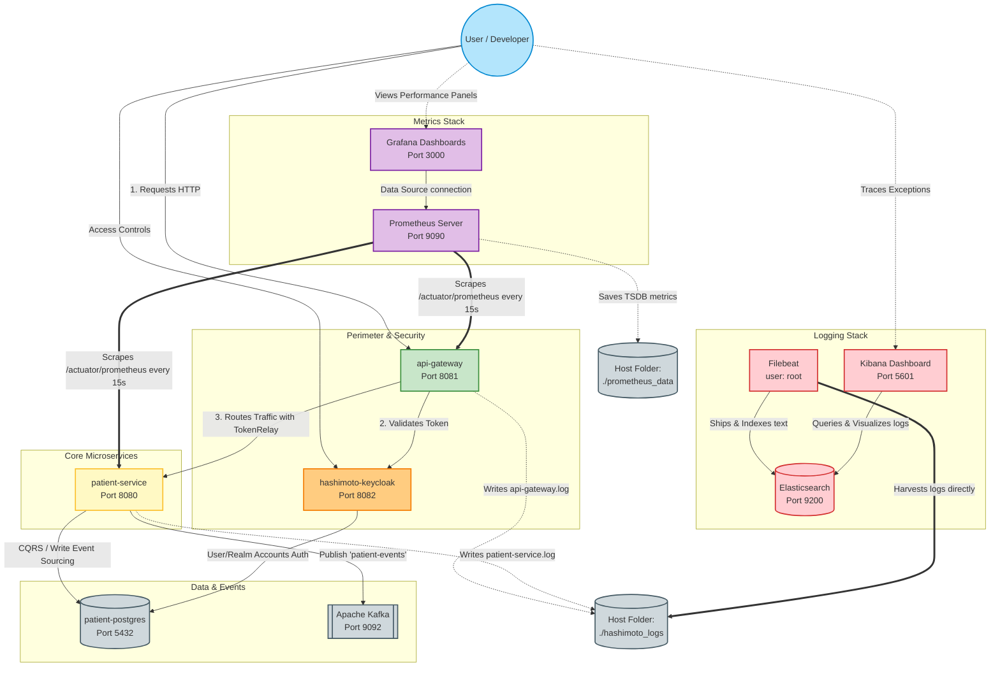

```mermaid
graph TD
%% Define Styles and Colors
classDef client fill:#b3e5fc,stroke:#0288d1,stroke-width:2px;
classDef gateway fill:#c8e6c9,stroke:#388e3c,stroke-width:2px;
classDef core fill:#fff9c4,stroke:#fbc02d,stroke-width:2px;
classDef security fill:#ffcc80,stroke:#f57c00,stroke-width:2px;
classDef infra fill:#cfd8dc,stroke:#455a64,stroke-width:2px;
classDef logging fill:#ffcdd2,stroke:#d32f2f,stroke-width:2px;
classDef metrics fill:#e1bee7,stroke:#7b1fa2,stroke-width:2px;

    %% Elements Definition
    User((User / Developer)):::client
    
    subgraph Perimeter_Layer [Perimeter & Security]
        GW[api-gateway <br> Port 8081]:::gateway
        KC[hashimoto-keycloak <br> Port 8082]:::security
    end

    subgraph Business_Logic [Core Microservices]
        PS[patient-service <br> Port 8080]:::core
    end

    subgraph Persistence_Streaming [Data & Events]
        DB[(patient-postgres <br> Port 5432)]:::infra
        KF[[Apache Kafka <br> Port 9092]]:::infra
    end

    subgraph ELK_Stack [Logging Stack]
        FB[Filebeat <br> user: root]:::logging
        ES[(Elasticsearch <br> Port 9200)]:::logging
        KB[Kibana Dashboard <br> Port 5601]:::logging
    end

    subgraph Prom_Grafana [Metrics Stack]
        PR[Prometheus Server <br> Port 9090]:::metrics
        GF[Grafana Dashboards <br> Port 3000]:::metrics
    end

    %% Network & Traffic Flows
    User -->|1. Requests HTTP| GW
    User -->|Access Controls| KC
    GW -->|2. Validates Token| KC
    GW -->|3. Routes Traffic with TokenRelay| PS
    
    %% Business Internal Dependencies
    PS -->|CQRS / Write Event Sourcing| DB
    PS -->|Publish 'patient-events'| KF
    KC -->|User/Realm Accounts Auth| DB

    %% Logging Pipeline (Push Model)
    GW -.->|Writes api-gateway.log| LogDir[(Host Folder: <br> ./hashimoto_logs)]:::infra
    PS -.->|Writes patient-service.log| LogDir
    FB ===>|Harvests logs directly| LogDir
    FB -->|Ships & Indexes text| ES
    KB -->|Queries & Visualizes logs| ES

    %% Metrics Pipeline (Pull Model - Scrape)
    PR ==>|Scrapes /actuator/prometheus every 15s| GW
    PR ==>|Scrapes /actuator/prometheus every 15s| PS
    PR -.->|Saves TSDB metrics| PromDir[(Host Folder: <br> ./prometheus_data)]:::infra
    GF -->|Data Source connection| PR
    User -.->|Views Performance Panels| GF
    User -.->|Traces Exceptions| KB
```