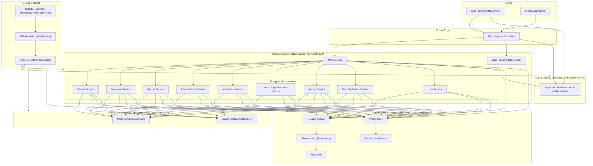

# Prototype Kubernetes architecture

```mermaid
flowchart TB

subgraph Clients["Clients"]
  WebApp["Web Frontend (React/Vite)"]
  MobileApp["Mobile App (future)"]
end

subgraph Edge["Cluster Edge"]
  Ingress["Nginx Ingress Controller"]
end

subgraph AppLayer["Application Layer (Namespace: hashimoto-app)"]
  APIGateway["API Gateway"]
  
  subgraph Microservices["Business Microservices"]
    Patient["Patient Service"]
    Symptom["Symptom Service"]
    Report["Report Service"]
    Profile["Person Profile Service"]
    Medication["Medication Service"]
    Appointments["Medical Appointments Service"]
    Activity["Activity Service"]
    DailyReflection["Daily Reflection Service"]
    UserSvc["User Service"]
  end
  
  Frontend["Web Frontend Deployment"]
end

subgraph AuthLayer["Auth & Identity (Namespace: hashimoto-infra)"]
  Keycloak["Keycloak (Authentication & Authorization)"]
end

subgraph DataLayer["Data & Messaging (Namespace: hashimoto-infra)"]
  Postgres["PostgreSQL (StatefulSet)"]
  Kafka["Apache Kafka (StatefulSet)"]
end

subgraph Observability["Observability & Logging (Namespace: hashimoto-infra)"]
  Filebeat["Filebeat Agents"]
  Elasticsearch["Elasticsearch (StatefulSet)"]
  Kibana["Kibana UI"]
  Prometheus["Prometheus"]
  Grafana["Grafana Dashboards"]
end

subgraph GitOps["GitOps & CI/CD"]
  GitHub["GitHub Repository (Monorepo + Microservices)"]
  Actions["GitHub Actions (CI Pipeline)"]
  ArgoCD["ArgoCD (GitOps Controller)"]
end

%% Client traffic
WebApp --> Ingress
MobileApp --> Ingress

%% Ingress routing
Ingress --> APIGateway
Ingress --> Frontend
Ingress --> Keycloak

%% Gateway to microservices
APIGateway --> Patient
APIGateway --> Symptom
APIGateway --> Report
APIGateway --> Profile
APIGateway --> Medication
APIGateway --> Appointments
APIGateway --> Activity
APIGateway --> DailyReflection
APIGateway --> UserSvc

%% Microservices to data
Patient --> Postgres
Symptom --> Postgres
Report --> Postgres
Profile --> Postgres
Medication --> Postgres
Appointments --> Postgres
Activity --> Postgres
DailyReflection --> Postgres
UserSvc --> Postgres

Patient --> Kafka
Symptom --> Kafka
Report --> Kafka
Activity --> Kafka
DailyReflection --> Kafka

%% Auth integration
WebApp --> Keycloak
APIGateway --> Keycloak

%% Logging & metrics
Patient --> Filebeat
Symptom --> Filebeat
Report --> Filebeat
Profile --> Filebeat
Medication --> Filebeat
Appointments --> Filebeat
Activity --> Filebeat
DailyReflection --> Filebeat
UserSvc --> Filebeat
APIGateway --> Filebeat

Filebeat --> Elasticsearch
Elasticsearch --> Kibana

Patient --> Prometheus
Symptom --> Prometheus
Report --> Prometheus
Profile --> Prometheus
Medication --> Prometheus
Appointments --> Prometheus
Activity --> Prometheus
DailyReflection --> Prometheus
UserSvc --> Prometheus
APIGateway --> Prometheus

Prometheus --> Grafana

%% GitOps flow
GitHub --> Actions
Actions --> ArgoCD
ArgoCD --> AppLayer
ArgoCD --> AuthLayer
ArgoCD --> DataLayer
ArgoCD --> Observability


```

# Hashimoto Application Architecture on Kubernetes

```mermaid

flowchart TB

%% Clients
subgraph Clients["Clients"]
WebApp["Web Frontend (React/Vite)"]
MobileApp["Mobile App (future)"]
end

%% Ingress
subgraph Edge["Cluster Edge"]
Ingress["Nginx Ingress Controller"]
end

%% Application Layer
subgraph AppLayer["Application Layer (Namespace: hashimoto-app)"]
APIGateway["API Gateway"]

subgraph Microservices["Business Microservices"]
Patient["Patient Service"]
Symptom["Symptom Service"]
Report["Report Service"]
Profile["Person Profile Service"]
Medication["Medication Service"]
Appointments["Medical Appointments Service"]
Activity["Activity Service"]
DailyReflection["Daily Reflection Service"]
UserSvc["User Service"]
end

Frontend["Web Frontend Deployment"]
end

%% Auth Layer
subgraph AuthLayer["Auth & Identity (Namespace: hashimoto-infra)"]
Keycloak["Keycloak (Authentication & Authorization)"]
end

%% Data Layer
subgraph DataLayer["Data & Messaging (Namespace: hashimoto-infra)"]
Postgres["PostgreSQL (StatefulSet)"]
Kafka["Apache Kafka (StatefulSet)"]
end

%% Observability
subgraph Observability["Observability & Logging (Namespace: hashimoto-infra)"]
Filebeat["Filebeat Agents"]
Elasticsearch["Elasticsearch (StatefulSet)"]
Kibana["Kibana UI"]
Prometheus["Prometheus"]
Grafana["Grafana Dashboards"]
end

%% GitOps
subgraph GitOps["GitOps & CI/CD"]
GitHub["GitHub Repository (Monorepo + Microservices)"]
Actions["GitHub Actions (CI Pipeline)"]
ArgoCD["ArgoCD (GitOps Controller)"]
end

%% Client traffic
WebApp --> Ingress
MobileApp --> Ingress

%% Ingress routing
Ingress --> APIGateway
Ingress --> Frontend
Ingress --> Keycloak

%% Gateway to microservices
APIGateway --> Patient
APIGateway --> Symptom
APIGateway --> Report
APIGateway --> Profile
APIGateway --> Medication
APIGateway --> Appointments
APIGateway --> Activity
APIGateway --> DailyReflection
APIGateway --> UserSvc

%% Microservices to data
Patient --> Postgres
Symptom --> Postgres
Report --> Postgres
Profile --> Postgres
Medication --> Postgres
Appointments --> Postgres
Activity --> Postgres
DailyReflection --> Postgres
UserSvc --> Postgres

Patient --> Kafka
Symptom --> Kafka
Report --> Kafka
Activity --> Kafka
DailyReflection --> Kafka

%% Auth integration
WebApp --> Keycloak
APIGateway --> Keycloak

%% Logging & metrics
Patient --> Filebeat
Symptom --> Filebeat
Report --> Filebeat
Profile --> Filebeat
Medication --> Filebeat
Appointments --> Filebeat
Activity --> Filebeat
DailyReflection --> Filebeat
UserSvc --> Filebeat
APIGateway --> Filebeat

Filebeat --> Elasticsearch
Elasticsearch --> Kibana

Patient --> Prometheus
Symptom --> Prometheus
Report --> Prometheus
Profile --> Prometheus
Medication --> Prometheus
Appointments --> Prometheus
Activity --> Prometheus
DailyReflection --> Prometheus
UserSvc --> Prometheus
APIGateway --> Prometheus

Prometheus --> Grafana

%% GitOps flow
GitHub --> Actions
Actions --> ArgoCD
ArgoCD --> AppLayer
ArgoCD --> AuthLayer
ArgoCD --> DataLayer
ArgoCD --> Observability

```

