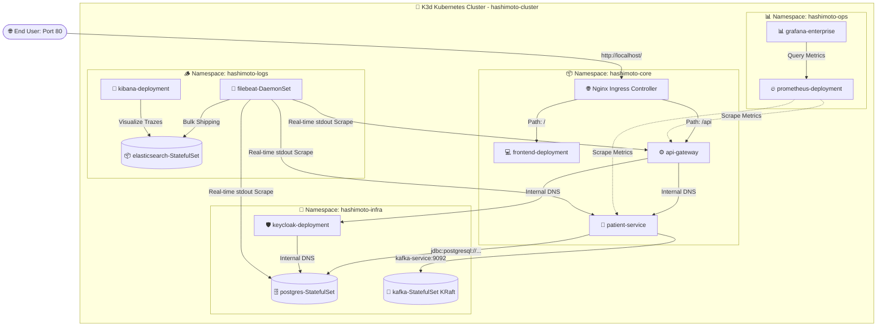

# 🏛️ Hashimoto Platform - Kubernetes (K8s) Orchestration Manual

This document provides the formal architecture specification, roadmap, and essential operations guide for deploying and managing **Hashimoto Platform** within a production-grade Kubernetes cluster, migrated from the legacy Docker Compose environment.

---

## 🗺️ 1. Core Architecture Diagram (Enterprise Namespace Model)

External network traffic enters through host port `80` onto the **Nginx Ingress Controller**, which securely routes requests inside the cluster based on isolated corporate Namespace policies.



---

## 🏛️ 2. Cluster Topology & Node Roles (K3d Local Architecture)

The infrastructure runs locally using **K3d (Rancher-backed K3s)**. The environment runs over **3 Docker containers acting as hardware nodes** to emulate a production environment:

1. **`k3d-hashimoto-cluster-server-0` (Control Plane / Master):** Runs the Kubernetes API Server, Scheduler, and Controller Manager, persisting cluster states into an internal `etcd` engine.
2. **`k3d-hashimoto-cluster-agent-0` & `agent-1` (Worker Nodes):** Active processing units where your Asus Zenbook (i9/32GB RAM) distributes pods to execute enterprise application runtimes.
3. **`k3d-hashimoto-cluster-serverlb` (LoadBalancer Proxy):** A load-balancing proxy container that listens onto host ports `80` and `443` on Ubuntu, proxying traffic seamlessly to the Ingress Controller.

---

## 📂 3. Repository Manifest Structure

To enforce isolation and maintain order, manifests are cleanly mapped under the `/k8s` directory:

```text
k8s/
├── namespaces.yaml                # Standard declaration of the 4 isolated system boundaries
├── core/                          # Business logic workload layer
│   ├── platform-env.yaml          # Core-local configuration ConfigMaps and Secrets
│   ├── api-gateway/
│   │   ├── deployment.yaml
│   │   └── service.yaml
│   │   └── ingress.yaml           # Global Nginx reverse proxy configurations
│   ├── patient-service/
│   │   ├── deployment.yaml
│   │   └── service.yaml
│   └── frontend/
│       ├── deployment.yaml
│       └── service.yaml
├── infra/                         # Core persistence and IAM services
│   ├── postgres/
│   │   ├── pvc.yaml               # 10Gi local-path permanent storage request
│   │   ├── statefulset.yaml       # Relational PostgreSQL 16 engine
│   │   └── service.yaml
│   ├── kafka/
│   │   ├── pvc.yaml               # Dedicate disk for KRaft cluster coordination logs
│   │   ├── statefulset.yaml       # Apache Kafka broker running under KRaft mode
│   │   └── service.yaml
│   └── keycloak/
│       ├── deployment.yaml        # Keycloak v24 Identity Provider linked to postgres-service
│       └── service.yaml
└── monitoring/                    # Cluster Telemetry & Telemetry Layer
    ├── prometheus-config.yaml     # Cross-namespace pod scraping discovery rules
    ├── prometheus.yaml            # TSDB Prometheus monitoring server enforced with RBAC
    ├── grafana.yaml               # Dashboard visual analytics via Grafana Enterprise
    └── logging/                   # Unified Log Management sub-layer
        ├── elasticsearch.yaml     # NoSQL database for bulk logs indexation (15Gi PVC)
        ├── kibana.yaml            # Operational logs querying user interface
        └── filebeat.yaml          # Node-level log scraping agent deployed as a DaemonSet
```

---

## 🧠 4. Architectural Deep Dive: Internal Service Mesh (CoreDNS)

Kubernetes **discards manual bridge networks**. Instead, it introduces an internal DNS engine called **CoreDNS**. Every time a `Service` is registered, CoreDNS maps an active local endpoint matching this strict enterprise standard:

```text
[service-name].[namespace].svc.cluster.local
```

### Production Examples in Hashimoto Platform:
* **Same-Namespace Call:** For **Keycloak** to connect to Postgres (both in `hashimoto-infra`), it uses `jdbc:postgresql://postgres-service:5432/hashimoto_db` (local service names suffice).
* **Cross-Namespace Call:** For **patient-service** (in `hashimoto-core`) to reach Postgres, it must call the formal mesh domain: `jdbc:postgresql://postgres-service.hashimoto-infra.svc.cluster.local:5432/hashimoto_db`.

---

## 🛠️ 5. Kubernetes Survival Cheat Sheet

Use these standard commands to administer, troubleshoot, and operate the cluster autonomously in restricted environments.

### 🔌 Managing the Local K3d Cluster Lifecycle
```bash
# Power up the cluster after host machine reboots or suspensions
k3d cluster start hashimoto-cluster

# Gracefully stop the cluster nodes to save host memory RAM
k3d cluster stop hashimoto-cluster

# Inspect active node status and verify hardware availability
kubectl get nodes
```

### 📥 Chronological Tier Deployment
```bash
# 1. Establish logical system boundaries
kubectl apply -f k8s/namespaces.yaml

# 2. Deploy persistence layer and IAM infrastructure
kubectl apply -f k8s/infra/postgres/
kubectl apply -f k8s/infra/kafka/
kubectl apply -f k8s/infra/keycloak/

# 3. Inject configuration context to the application mesh
kubectl apply -f k8s/core/platform-env.yaml
```

### 🔨 Image Compilation & Cluster Injection
Since K8s cannot build source code, you must build images on the host and import them into K3d nodes manually:
```bash
# Building and injecting patient-service
docker build -t hashimoto/patient-service:latest -f patient-service/Dockerfile .
k3d image import hashimoto/patient-service:latest -c hashimoto-cluster
kubectl apply -f k8s/core/patient-service/

# Building and injecting api-gateway
docker build -t hashimoto/api-gateway:latest -f api-gateway/Dockerfile .
k3d image import hashimoto/api-gateway:latest -c hashimoto-cluster
kubectl apply -f k8s/core/api-gateway/

# Building and injecting frontend
docker build -t hashimoto/frontend:latest -f hashimoto-tracker-app/Dockerfile ./hashimoto-tracker-app
k3d image import hashimoto/frontend:latest -c hashimoto-cluster
kubectl apply -f k8s/core/frontend/
```

### 🔍 Cluster Observability & Real-Time Debugging
```bash
# Query pod statuses across core business layers
kubectl get pods -n hashimoto-core

# Verify data tier containers and check if PVC disks are bound
kubectl get pods,pvc -n hashimoto-infra

# Monitor log streaming stacks (Elasticsearch, Kibana, Filebeat)
kubectl get pods -n hashimoto-logs

# Inspect active network routers and public endpoints
kubectl get ingress -n hashimoto-core

# Stream real-time console stdout for Java Spring Boot apps
kubectl logs deployment/patient-service -n hashimoto-core --tail=100 -f

# Force Nginx Ingress to clear routing table caches and hot-reload rules
kubectl delete pod -n ingress-nginx --all

# Emergency bypass tunnel to access the frontend directly through host port 8085
kubectl port-forward service/frontend-service 8085:80 -n hashimoto-core
```
